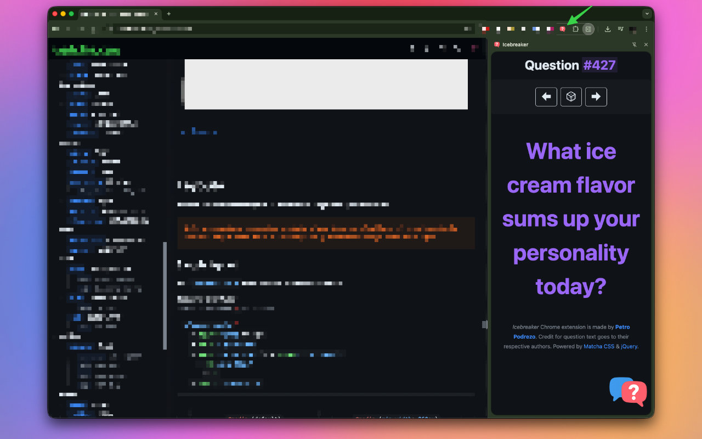

# 🎉 Icebreaker - Energize Your Team, One Question at a Time

**Turn boring meetings into fun team-building moments with just one click.**

Icebreaker is a lightweight Chrome extension that delivers over 400 fun and engaging questions right to your browser's sidebar. Spice up your team meetings, virtual standups, and corporate events with questions that get everyone laughing, sharing, and bonding as a team.

## 🚀 Why Teams Love Icebreaker

- **⚡ Instant Team Energy**: Transform dead air into laughter and engagement in seconds
- **🎲 Endless Fun**: Navigate through hundreds of entertaining questions or hit "Random" for spontaneous team moments
- **🛡️ Zero Hassle Setup**: Minimal permissions, no accounts needed - just install and start having fun
- **💼 Meeting-Ready**: Perfect for virtual meetings, team calls, and corporate retreats
- **🎯 Break the Routine**: Turn those awkward "how's everyone doing?" moments into genuine team bonding

Ideal for team leaders, HR professionals, meeting facilitators, and anyone looking to boost team morale and create a more engaging workplace culture.

## To do

- [X] ~Light/Dark mode~
- [ ] Generate questions with AI
- [ ] Track which questions have been asked
